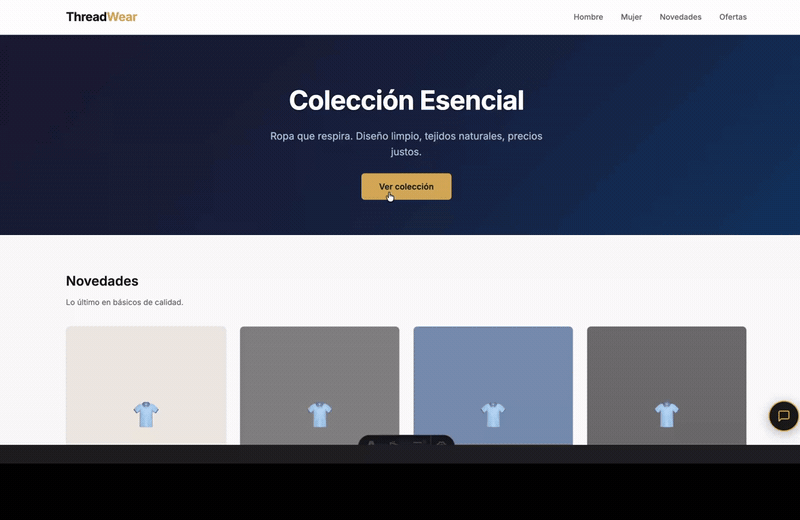

# ThreadBot — Chatbot para Tienda de Ropa

Chatbot conversacional con IA para atención al cliente de una tienda de ropa. Desarrollado con FastAPI y Groq (llama-3.3-70b-versatile).
Proyecto de prácticas en WinoWin · 2026.



*El asistente integrado en la tienda: saludo, botones de acceso rápido al catálogo y conversación en lenguaje natural.*

> ⚠️ **Sin demo pública.** El despliegue estuvo en Fly.io hasta 2026, pero entre el core y los
> flujos de n8n consumía por encima de lo que cubre el plan gratuito, así que se retiró de
> producción. **El proyecto se ejecuta entero en local con Docker** — ver "Puesta en marcha" más
> abajo. La documentación técnica completa está en `ThreadBot_Informe_Tecnico_Final.docx` y el
> manual de uso en `ThreadBot_Manual_Usuario.docx`.
>
> *(La API key de Groq del despliegue original está caducada: hay que poner una propia en `.env`,
> ver `.env.example`.)*

---

## Estado del proyecto

| Fase | Descripción | Estado |
|------|-------------|--------|
| 1 | Planificación y diseño | ✅ Completada |
| 2 | Backend base (FastAPI + Groq) | ✅ Completada |
| 3 | Base de datos (PostgreSQL) | ✅ Completada |
| 4 | Automatizaciones n8n | ✅ Completada |
| 5 | Interfaz web (frontend) | ✅ Completada |
| 6 | Pruebas y ajustes | ✅ Completada |
| 7 | Despliegue (Railway → Fly.io + Neon) | ✅ Completada |
| 8 | Panel admin + automatizaciones en nube + mejoras de venta | ✅ Completada |
| 9 | Panel de control del chatbot (configuración sin código) | 🔵 En curso |

---

## Funcionalidades

- 💬 Conversación natural con memoria de sesión
- 🛍️ Flujo completo de pedido: catálogo → selección → confirmación → email automático
- ❌ Cancelación de pedidos con verificación de email
- 📦 Control de stock en tiempo real (descuento automático al comprar, reposición al cancelar)
- 📧 Automatizaciones de email vía n8n:
  - Confirmación de pedido
  - Alerta de stock bajo al proveedor
  - Solicitud de factura
  - Seguimiento y cancelación
- 📊 Panel de administración con stock, pedidos y estadísticas en tiempo real
- 🤑 Técnicas de venta integradas: avisos de stock limitado, sugerencias y recomendaciones
- 🔒 Verificación de identidad en cancelaciones

---

## Stack

| Componente | Tecnología |
|------------|------------|
| Backend | FastAPI + Python |
| Modelo LLM | Groq · llama-3.3-70b-versatile |
| Base de datos | PostgreSQL (Neon — Frankfurt) |
| Automatizaciones | n8n (Fly.io) |
| Frontend | HTML + CSS + JS (sin frameworks) |
| Despliegue | Fly.io (Dockerfile) |
| Email | Resend |

---

## Estructura del proyecto

```
threadbot/
├── app/
│   ├── main.py               # Punto de entrada FastAPI + frontend estático
│   ├── core/
│   │   ├── config.py         # Variables de entorno y settings
│   │   └── prompts.py        # System prompt dinámico con catálogo
│   ├── api/
│   │   ├── chat.py           # Endpoints /chat, /orders, /alerts, /invoices, /products
│   │   └── health.py         # Endpoint /health
│   ├── services/
│   │   ├── llm_service.py    # Lógica de chat, pedidos y cancelaciones
│   │   ├── session.py        # Gestión de memoria de sesión
│   │   ├── products.py       # Catálogo y stock desde PostgreSQL
│   │   ├── orders.py         # Creación y consulta de pedidos
│   │   └── database.py       # SQLAlchemy engine + SessionLocal
│   ├── models/
│   │   └── db_models.py      # Modelos: Producto, Pedido, LineaPedido, SolicitudFactura, Alerta
│   └── schemas/
│       └── chat_schemas.py   # Pydantic request/response
├── n8n_export/               # Flujos de n8n exportados como JSON
├── frontend/
│   └── index.html            # Chat widget (dark premium, gold accents)
├── migrations/               # Alembic
├── scripts/
│   └── seed.py               # Seed inicial de productos
├── tests/
│   ├── test.py
│   ├── test_memoria.py
│   └── PRUEBAS.md            # 25 casos de prueba documentados
├── .env.example
├── requirements.txt
├── Dockerfile
├── .dockerignore
└── fly.toml                  # Configuración de despliegue Fly.io
```

---

## Instalación local

```bash
# 1. Crear entorno virtual
python3 -m venv .venv
source .venv/bin/activate

# 2. Instalar dependencias
pip install -r requirements.txt

# 3. Configurar variables de entorno
cp .env.example .env
# Edita .env con tus claves

# 4. Arrancar el servidor
uvicorn app.main:app --reload
```

Abre http://localhost:8000 para el chat widget y http://localhost:8000/admin para el panel.

---

## Variables de entorno

```
GROQ_API_KEY=          # API key de Groq
DATABASE_URL=          # Connection string de PostgreSQL (Neon u otro)
RESEND_API_KEY=        # API key de Resend para emails
N8N_BASE_URL=          # URL base de n8n (ej: https://threadbot-n8n.fly.dev)
APP_BASE_URL=          # URL pública de esta app (ej: https://threadbot-winowin.fly.dev)
```

---

## Despliegue en Fly.io

```bash
# Login
fly auth login

# Desplegar la app
fly deploy --remote-only

# Configurar variables de entorno
fly secrets set GROQ_API_KEY=... DATABASE_URL=... RESEND_API_KEY=... \
  N8N_BASE_URL=https://threadbot-n8n.fly.dev \
  APP_BASE_URL=https://threadbot-winowin.fly.dev
```

El n8n corre como app separada en `threadbot-n8n` (ver `fly.n8n.toml`).  
Los workflows se importan desde `n8n_export/` via la API de n8n tras el primer despliegue.

---

## API Endpoints

| Método | Endpoint | Descripción |
|--------|----------|-------------|
| GET | `/` | Frontend (chat widget) |
| GET | `/health` | Estado del servicio |
| POST | `/chat` | Enviar mensaje al bot |
| GET | `/products` | Listado de productos |
| GET | `/orders/{id}` | Consultar pedido |
| POST | `/orders/{id}/confirm` | Confirmar pedido |
| POST | `/orders/{id}/status` | Actualizar estado |
| GET | `/alerts/pending` | Alertas de stock pendientes |
| POST | `/alerts/{id}/mark-sent` | Marcar alerta como enviada |
| POST | `/invoices/request` | Solicitar factura |
| GET | `/admin` | Panel de administración |
| GET | `/docs` | Swagger UI |

---

**Autor:** Jonathan Neto · Prácticas WinoWin 2026
